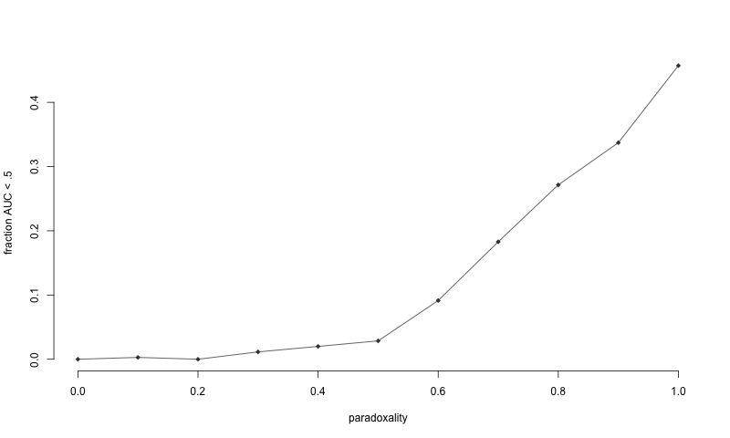

# degenerate_auc

Some time you can get AUC < .5 without there being something wrong with
your model or the way you calculated AUC. How?

## Kind of a Simpson's paradox:
This is how to draw samples that force some strange AUC behaviour: 

 1. let x_i = mu_i + e_i.
 1. Draw an utcome y_i and a stratum, s_i, both in {0,1} for x_i 
 1. let mu_i be 1 if s_i = y_i, 0 otherwise
 1. e_i is iid noise ~N(0, sigma)
 
Observations about this:

 * Ignoring strata there is basically no information, whether the outcome is 0 or 1
 you have mixture of two normals with modes at 0 and 1.
 * Taking strata into account, you have in stratum 1: E(X | y = 0) > E(X | y = 1)
 * In stratum 0, the opposite: E(X | y = 0) < E(X | y = 1)
 * If the proportions of stratum 0 and stratum 1 in training and test data are 
 sufficiently different, you're actually learning the opposite effect of what's happening
 in test data. 
 
You'd be best off predicting the opposite of what the model says, but
you can't know that because you ignored the strata. Hence, outcome 1 samples are
ranked lower than outcome 0 samples in the test set because you had a paradox 
going on. 

Below is a simulation study where I've explored this a bit. Paradox degree, d, is 
something I've added to the model to Prove That I'm Right. Basically push 
E(X | y=1) in the positive direction by x_i <- x_i + (1-d)sigma. At d=1, the paradox
above is in full effect; at d=0 the effects in both strata point in the same direction by
a comfortable margin. The y-axis is simply the fraction of simulations where AUC < .5.

